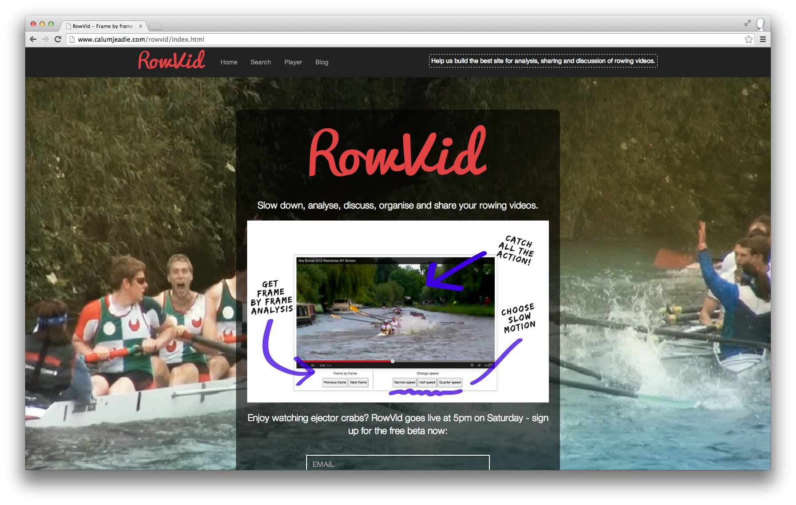
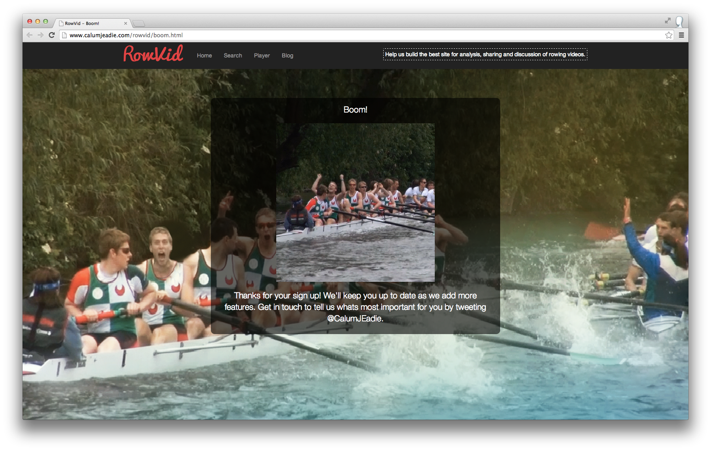
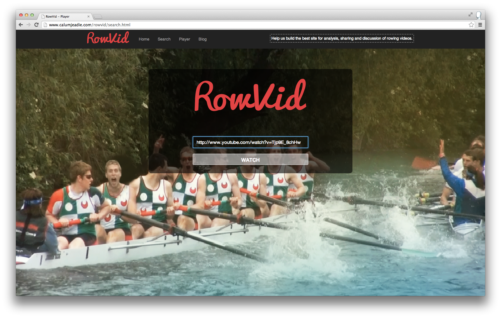
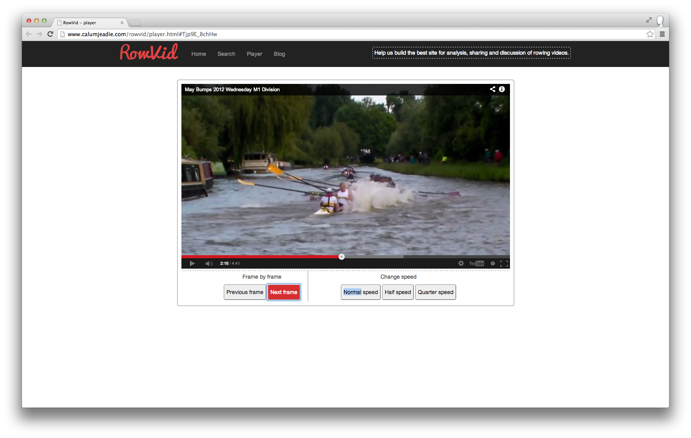

RowVid
======

[calumjeadie.com/rowvid/](http://calumjeadie.com/rowvid/)

Watch YouTube frame by frame and in slow motion.

Motivation
----------

RowVid was originally created by [Calum Eadie](https://twitter.com/CalumJEadie), [Andrew Ratomski](https://twitter.com/AHTomski) and [Jack Lawrence Jones](https://twitter.com/busterlj) at an Entrepreneur First Hackathon, to help rowers analyse training and race videos.

Since then it has evolved into general purpose player for frame by frame and slow motion playback of any YouTube video.

Screenshots
-----------

### Hackathon

References
----------

https://developers.google.com/youtube/js_api_reference

https://developers.google.com/youtube/youtube_player_demo

https://code.google.com/apis/ajax/playground/#change_the_playing_video

https://developers.google.com/youtube/iframe_api_reference